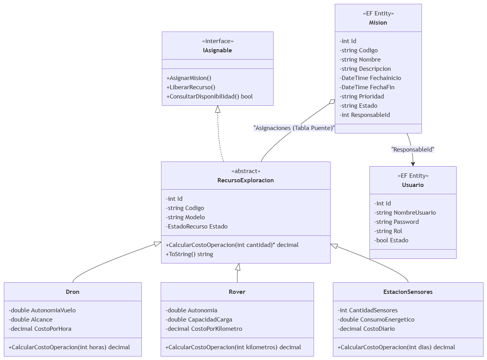

# OperacionOrbita
Prototipo de escritorio en C# para la gestión de misiones científicas. Implementa principios avanzados de Programación Orientada a Objetos (Herencia, Polimorfismo), arquitectura en 3 capas y persistencia de datos mediante Entity Framework y SQL Server.

# 🚀 ORBITA Control - Centro de Misiones Científicas

Sistema de escritorio desarrollado para la Organización Regional de Búsqueda, Investigación y Tecnología Avanzada (ORBITA). Permite administrar misiones científicas y asignar recursos tecnológicos (Drones, Rovers, Estaciones de Sensores) garantizando la integridad operativa mediante estrictas reglas de negocio.

## 📌 Arquitectura y Módulos del Sistema

La solución está estructurada en tres capas lógicas para separar las responsabilidades.

*   **`ORBITA.Dominio`**: Contiene la lógica pura del negocio, clases abstractas (`RecursoExploracion`), interfaces (`IAsignable`), enumeraciones y el polimorfismo para el cálculo de costos operativos[cite: 2].
*   **`ORBITA.Datos`**: Gestiona la persistencia mediante **Entity Framework (Database First)**, albergando el modelo `.edmx` y las entidades generadas desde SQL Server.
*   **`ORBITA.App`**: Capa de presentación desarrollada en **Windows Forms**. Maneja el inicio de sesión, el enrutamiento de interfaces y el "Protocolo de Seguridad ORBITA".

## 🛠️ Principios SOLID Identificados

En el diseño arquitectónico de este proyecto se aplicaron los siguientes principios.

1.  **Single Responsibility Principle (SRP):** 
    *   *Ubicación:* En la separación física de los proyectos `ORBITA.Dominio` y `ORBITA.Datos`.
    *   *Justificación:* La clase `Dron` se encarga exclusivamente de calcular su costo matemático mediante sus propiedades físicas, mientras que el guardado de ese Dron en la base de datos es responsabilidad exclusiva del contexto de Entity Framework. Evita que un error de red rompa la lógica matemática.
2.  **Open/Closed Principle (OCP):**
    *   *Ubicación:* En la clase abstracta `RecursoExploracion` y el método virtual `CalcularCostoOperacion()`.
    *   *Justificación:* El sistema está abierto a la extensión (si ORBITA adquiere submarinos en el futuro, solo se crea la clase `Submarino` heredando de la base) pero cerrado a la modificación (no hay que reescribir ni un solo `if` en el formulario principal para calcular su costo).

## 💡 Propuesta de Patrón de Diseño (Mejora Futura)

Para futuras versiones del sistema, se propone la implementación del siguiente patrón:

*   **Nombre:** Factory Method.
*   **Clasificación:** Creacional.
*   **Problema a resolver:** Actualmente, para instanciar objetos polimórficos desde los datos de Entity Framework, se utilizan sentencias `if (tipo == "Dron")`. Si la cantidad de vehículos crece, este bloque será inmanejable.
*   **Implementación:** Una clase `RecursoFactory` que reciba el string del tipo de la base de datos y retorne automáticamente la instancia correcta de `RecursoExploracion`, delegando la creación de objetos fuera del formulario de la interfaz gráfica.

## ⚙️ Instrucciones de Ejecución

1.  Clonar este repositorio en tu máquina local.
2.  Abrir SQL Server Management Studio (SSMS) y ejecutar el script proporcionado en `\Scripts\OrbitaDB_Script.sql` para crear la base de datos e insertar los datos iniciales.
3.  Abrir la solución `SistemaOrbita.sln` en Visual Studio.
4.  En el proyecto `ORBITA.App`, abrir el archivo `App.config` y actualizar el `connectionString` para que el `data source=` apunte al nombre de tu servidor SQL local.
5.  Compilar la solución para restaurar los paquetes de Entity Framework.
6.  Ejecutar el proyecto.

## 🔐 Credenciales de Prueba

La base de datos incluye los siguientes usuarios configurados con distintos niveles de acceso[cite: 2]:

| Usuario | Contraseña | Rol | Acceso |
| :--- | :--- | :--- | :--- |
| **Douglas** | `12345` | Administrador | Total |
| **coord_operaciones** | `12345` | Coordinador | Misiones y Recursos] |
| **auditor_externo** | `12345` | Auditor | Solo consultas|

## 📐 Diagrama de Clases UML

## Integrantes
*   **Noyola Moz, Michael Douglas** Principal

## Pruebas de la aplicación

